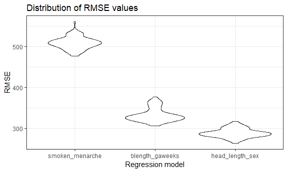

p8105\_hw6\_sal2222
================
Stephen Lewandowski
November 16, 2018

### Problem 1 - Homicide data

This problem utilizes data from *The Washington Post* on homicides in 50 U.S. cities. The code chunk below imports and cleans the data. I referred to the posted solution of Homework 5, Problem 2 for some of the data cleaning code structure and naming conventions.

``` r
homicide_df <- 
  read_csv("data/homicide-data.csv", na = c("", "NA", "Unknown")) %>%
  mutate(
    city_state = str_c(city, state, sep = ", "),
    resolution = factor(case_when(
      disposition == "Closed without arrest" ~ "unsolved",
      disposition == "Open/No arrest"        ~ "unsolved",
      disposition == "Closed by arrest"      ~ "solved"
    )),
    victim_race = factor(case_when(
      victim_race == "White" ~ "white",
      victim_race != "white" ~ "non-white"
    )),
    victim_race = fct_relevel(victim_race, "white"),
    victim_age = as.numeric(victim_age),
    victim_sex = factor(victim_sex)) %>% 
  filter(!city_state %in% c("Tulsa, AL", "Dallas, TX", "Phoenix, AZ", "Kansas City, MO")) 
```

I excluded cities that do not report race as well as a data entry error ("Tulsa, AL").

Baltimore model
---------------

For the city of Baltimore, MD, I will the glm function to fit a logistic regression with resolved vs unresolved as the outcome and victim age, sex and race as predictors. The output is saved as R object `fit_logistic`.

``` r

fit_logistic_baltimore <- 
  homicide_df %>% 
    filter(city_state == "Baltimore, MD") %>% 
    dplyr::select(resolution, victim_age, victim_race, victim_sex) %>% 
    glm(resolution ~ victim_age + victim_race + victim_sex, data = ., family = binomial()) 
```

I will apply `broom::tidy` to `fit_logistic` and obtain the estimate and confidence interval of the adjusted odds ratio for solving homicides comparing no n-white victims to white victims keeping all other variables fixed.

``` r

broom::tidy(fit_logistic_baltimore, conf.int = TRUE) %>% 
  mutate(OR = exp(estimate),
         conf_low_OR = exp(conf.low),
         conf_high_OR = exp(conf.high)) %>%
  dplyr::select(term, OR, conf_low_OR, conf_high_OR) %>%
  filter(term == "victim_racenon-white") %>% 
  knitr::kable(digits = 3)
```

| term                  |    OR|  conf\_low\_OR|  conf\_high\_OR|
|:----------------------|-----:|--------------:|---------------:|
| victim\_racenon-white |  2.27|          1.614|           3.203|

All cities
----------

Now, I will run a glm for each of the cities in my dataset and extract the adjusted odds ratio and CI for solving homicides comparing non-white victims to white victims within a “tidy” pipeline.

``` r

nest_glm_all <-
  homicide_df %>% 
  group_by(city_state) %>% 
  nest() %>% 
  mutate(models = map(data, ~glm(resolution ~ victim_age + victim_race + victim_sex, data = ., family = binomial())),
         models = map(models, broom::tidy, conf.int = TRUE)) %>% 
  select(-data) %>% 
  unnest()
```

From these resuts, I will create a dataframe with the estimated, adjusted ORs and CIs for each city comparing unsolved cases among non-white and white victims.

``` r
all_city_OR <-
  nest_glm_all %>% 
    mutate(OR = exp(estimate),
           conf_low_OR = exp(conf.low),
           conf_high_OR = exp(conf.high)) %>%
    dplyr::select(city_state, term, OR, conf_low_OR, conf_high_OR) %>%
    filter(term == "victim_racenon-white")  
```

The results are displayed as a `kable` table below.

``` r
all_city_OR %>%
   knitr::kable(digits = 3)
```

| city\_state        | term                  |     OR|  conf\_low\_OR|  conf\_high\_OR|
|:-------------------|:----------------------|------:|--------------:|---------------:|
| Albuquerque, NM    | victim\_racenon-white |  1.353|          0.820|           2.248|
| Atlanta, GA        | victim\_racenon-white |  1.328|          0.770|           2.356|
| Baltimore, MD      | victim\_racenon-white |  2.270|          1.614|           3.203|
| Baton Rouge, LA    | victim\_racenon-white |  1.498|          0.712|           3.285|
| Birmingham, AL     | victim\_racenon-white |  0.962|          0.570|           1.635|
| Boston, MA         | victim\_racenon-white |  7.895|          3.504|          21.193|
| Buffalo, NY        | victim\_racenon-white |  2.549|          1.400|           4.733|
| Charlotte, NC      | victim\_racenon-white |  1.794|          1.052|           3.194|
| Chicago, IL        | victim\_racenon-white |  1.779|          1.362|           2.316|
| Cincinnati, OH     | victim\_racenon-white |  3.141|          1.847|           5.558|
| Columbus, OH       | victim\_racenon-white |  1.162|          0.861|           1.567|
| Denver, CO         | victim\_racenon-white |  1.661|          0.992|           2.796|
| Detroit, MI        | victim\_racenon-white |  1.535|          1.150|           2.051|
| Durham, NC         | victim\_racenon-white |  0.997|          0.408|           2.562|
| Fort Worth, TX     | victim\_racenon-white |  1.194|          0.791|           1.809|
| Fresno, CA         | victim\_racenon-white |  2.248|          1.189|           4.528|
| Houston, TX        | victim\_racenon-white |  1.146|          0.918|           1.432|
| Indianapolis, IN   | victim\_racenon-white |  1.982|          1.503|           2.626|
| Jacksonville, FL   | victim\_racenon-white |  1.519|          1.160|           1.993|
| Las Vegas, NV      | victim\_racenon-white |  1.311|          1.019|           1.691|
| Long Beach, CA     | victim\_racenon-white |  1.260|          0.623|           2.638|
| Los Angeles, CA    | victim\_racenon-white |  1.502|          1.092|           2.078|
| Louisville, KY     | victim\_racenon-white |  2.552|          1.695|           3.888|
| Memphis, TN        | victim\_racenon-white |  1.285|          0.866|           1.937|
| Miami, FL          | victim\_racenon-white |  1.734|          1.129|           2.661|
| Milwaukee, wI      | victim\_racenon-white |  1.581|          1.019|           2.511|
| Minneapolis, MN    | victim\_racenon-white |  1.549|          0.831|           2.933|
| Nashville, TN      | victim\_racenon-white |  1.108|          0.807|           1.528|
| New Orleans, LA    | victim\_racenon-white |  2.142|          1.354|           3.393|
| New York, NY       | victim\_racenon-white |  1.880|          1.011|           3.694|
| Oakland, CA        | victim\_racenon-white |  4.695|          2.391|          10.109|
| Oklahoma City, OK  | victim\_racenon-white |  1.468|          1.031|           2.096|
| Omaha, NE          | victim\_racenon-white |  5.879|          3.334|          10.944|
| Philadelphia, PA   | victim\_racenon-white |  1.553|          1.176|           2.064|
| Pittsburgh, PA     | victim\_racenon-white |  3.552|          2.061|           6.359|
| Richmond, VA       | victim\_racenon-white |  2.235|          0.869|           6.933|
| San Antonio, TX    | victim\_racenon-white |  1.451|          0.975|           2.181|
| Sacramento, CA     | victim\_racenon-white |  1.281|          0.742|           2.256|
| Savannah, GA       | victim\_racenon-white |  1.653|          0.783|           3.586|
| San Bernardino, CA | victim\_racenon-white |  1.136|          0.500|           2.540|
| San Diego, CA      | victim\_racenon-white |  2.069|          1.285|           3.397|
| San Francisco, CA  | victim\_racenon-white |  2.182|          1.391|           3.472|
| St. Louis, MO      | victim\_racenon-white |  1.733|          1.222|           2.472|
| Stockton, CA       | victim\_racenon-white |  2.662|          1.403|           5.172|
| Tampa, FL          | victim\_racenon-white |  0.863|          0.436|           1.710|
| Tulsa, OK          | victim\_racenon-white |  1.679|          1.155|           2.461|
| Washington, DC     | victim\_racenon-white |  1.946|          1.003|           3.975|

I will now plot the estimated ORs and CIs for each city.

``` r

all_city_OR %>%
  mutate(city_state = forcats::fct_reorder(city_state, OR)) %>%
  ggplot(aes(x = city_state, y = OR)) + 
      geom_errorbar(aes(ymin = conf_low_OR, ymax = conf_high_OR), width = 0.2) +
      geom_point(size = 3, shape = 21, fill = "white") + 
  labs(
    title = "Unsolved homicides, comparing non-white victims to white victims",
    x = "City",
    y = "Adjusted odds ratio",
    caption = "Data from the Washington Post, adjusted for victim age, race, and gender."
  ) + 
    theme(axis.text.x = element_text(angle = 90, hjust = 1, size = 8))
```


The results and plot indicate that the U.S. cities with the largest discrepencies in unsolved homicide case by victim race, after adjusting for victim age and gender are Boston, Omaha, Oakland, Pittsburgh, and Cincinnati. Boston also has the largest confidence interval about the adjusted OR.

### Problem 2 - Birthweight data

I will now load and clean birthweight data for 4,342 children for regression analysis.

``` r
birthweight_df <- 
  read_csv("data/birthweight.csv") %>% 
  mutate(
      babysex = factor(babysex),
      frace = factor(frace),
      malform = factor(malform),
      mrace = factor(mrace)
  )
## Parsed with column specification:
## cols(
##   .default = col_integer(),
##   gaweeks = col_double(),
##   ppbmi = col_double(),
##   smoken = col_double()
## )
## See spec(...) for full column specifications.
```

There is no missing data in the dataframe.

``` r
birthweight_df %>% 
  is.na() %>% summary()
##   babysex          bhead          blength           bwt         
##  Mode :logical   Mode :logical   Mode :logical   Mode :logical  
##  FALSE:4342      FALSE:4342      FALSE:4342      FALSE:4342     
##    delwt          fincome          frace          gaweeks       
##  Mode :logical   Mode :logical   Mode :logical   Mode :logical  
##  FALSE:4342      FALSE:4342      FALSE:4342      FALSE:4342     
##   malform         menarche        mheight          momage       
##  Mode :logical   Mode :logical   Mode :logical   Mode :logical  
##  FALSE:4342      FALSE:4342      FALSE:4342      FALSE:4342     
##    mrace           parity         pnumlbw         pnumsga       
##  Mode :logical   Mode :logical   Mode :logical   Mode :logical  
##  FALSE:4342      FALSE:4342      FALSE:4342      FALSE:4342     
##    ppbmi            ppwt           smoken          wtgain       
##  Mode :logical   Mode :logical   Mode :logical   Mode :logical  
##  FALSE:4342      FALSE:4342      FALSE:4342      FALSE:4342
```

Proposed regression model for birthweight: smoking and maternal age
-------------------------------------------------------------------

I propose a model for birthweight based on a hypothesized structure. I am interested in seeing the effects of smoking as an environmental exposure as well as maternal age. I will examine the fit of `smoken` and `menarche` independently, jointly, and with interaction.

First, I will review the simple linear regression estimates and p-values.

``` r
lm(bwt ~ smoken, data = birthweight_df) %>% broom::tidy()
## # A tibble: 2 x 5
##   term        estimate std.error statistic     p.value
##   <chr>          <dbl>     <dbl>     <dbl>       <dbl>
## 1 (Intercept)  3136.        8.88    353.   0          
## 2 smoken         -5.23      1.05     -5.00 0.000000607
lm(bwt ~ menarche, data = birthweight_df) %>% broom::tidy()
## # A tibble: 2 x 5
##   term        estimate std.error statistic p.value
##   <chr>          <dbl>     <dbl>     <dbl>   <dbl>
## 1 (Intercept)  3220.       66.3      48.6    0    
## 2 menarche       -8.47      5.26     -1.61   0.108
lm(bwt ~ smoken + menarche, data = birthweight_df) %>% broom::tidy()
## # A tibble: 3 x 5
##   term        estimate std.error statistic     p.value
##   <chr>          <dbl>     <dbl>     <dbl>       <dbl>
## 1 (Intercept)  3237.       66.2      48.9  0          
## 2 smoken         -5.20      1.05     -4.97 0.000000690
## 3 menarche       -8.04      5.25     -1.53 0.126
lm(bwt ~ smoken + menarche + (smoken * menarche), data = birthweight_df) %>% broom::tidy()
## # A tibble: 4 x 5
##   term             estimate std.error statistic p.value
##   <chr>               <dbl>     <dbl>     <dbl>   <dbl>
## 1 (Intercept)      3246.       75.9      42.7     0    
## 2 smoken             -7.26      8.56     -0.849   0.396
## 3 menarche           -8.76      6.03     -1.45    0.146
## 4 smoken:menarche     0.164     0.675     0.243   0.808
```

Next, I will review model fit statistics.

``` r
lm(bwt ~ smoken, data = birthweight_df) %>% broom::glance()
## # A tibble: 1 x 11
##   r.squared adj.r.squared sigma statistic p.value    df  logLik    AIC
## *     <dbl>         <dbl> <dbl>     <dbl>   <dbl> <int>   <dbl>  <dbl>
## 1   0.00572       0.00549  511.      25.0 6.07e-7     2 -33236. 66478.
## # ... with 3 more variables: BIC <dbl>, deviance <dbl>, df.residual <int>
lm(bwt ~ menarche, data = birthweight_df) %>% broom::glance()
## # A tibble: 1 x 11
##   r.squared adj.r.squared sigma statistic p.value    df  logLik    AIC
## *     <dbl>         <dbl> <dbl>     <dbl>   <dbl> <int>   <dbl>  <dbl>
## 1  0.000597      0.000366  512.      2.59   0.108     2 -33247. 66501.
## # ... with 3 more variables: BIC <dbl>, deviance <dbl>, df.residual <int>
lm(bwt ~ smoken + menarche, data = birthweight_df) %>% broom::glance()
## # A tibble: 1 x 11
##   r.squared adj.r.squared sigma statistic p.value    df  logLik    AIC
## *     <dbl>         <dbl> <dbl>     <dbl>   <dbl> <int>   <dbl>  <dbl>
## 1   0.00626       0.00580  511.      13.7 1.22e-6     3 -33235. 66478.
## # ... with 3 more variables: BIC <dbl>, deviance <dbl>, df.residual <int>
lm(bwt ~ smoken + menarche + (smoken * menarche), data = birthweight_df) %>% broom::glance()
## # A tibble: 1 x 11
##   r.squared adj.r.squared sigma statistic p.value    df  logLik    AIC
## *     <dbl>         <dbl> <dbl>     <dbl>   <dbl> <int>   <dbl>  <dbl>
## 1   0.00627       0.00558  511.      9.12 5.11e-6     4 -33235. 66480.
## # ... with 3 more variables: BIC <dbl>, deviance <dbl>, df.residual <int>
```

Based on considration of parameter estimate results and goodness of fit tests (including maximized adjusted R-squared and minimized AIC), I select the model with both average number of cigarettes smoked per day during pregnancy and mother’s age at menarche (years). There is not significant interaction between these terms.

My selected model is: `lm(bwt ~ smoken + menarche)`.

``` r
smoken_menarche_fit <-
  lm(bwt ~ smoken + menarche, data = birthweight_df)
```

Residuals plot
--------------

Below is a plot of model residuals against fitted values.

``` r

smoken_menarche_resid <-
  modelr::add_residuals(birthweight_df, smoken_menarche_fit)

smoken_menarche_pred <-
modelr::add_predictions(birthweight_df, smoken_menarche_fit)

smoken_menarche_full <-
  birthweight_df %>% 
    mutate(resid = smoken_menarche_resid$resid,
           pred = smoken_menarche_pred$pred)
  
smoken_menarche_full %>% 
  ggplot(aes(x = pred, y = resid)) +
  geom_point() +
  geom_smooth() +
  labs(
    title = "Proposed model residuals against fitted values",
    x = "Predictions",
    y = "Residuals",
    caption = "Model: lm(bwt ~ smoken + menarche, data = birthweight_df)"
  ) 
## `geom_smooth()` using method = 'gam' and formula 'y ~ s(x, bs = "cs")'
```


In this plot, the range of residuals tends to increase as the predicted birthweight increases.

Model comparison
----------------

I will compare my model with two others.

``` r
blength_gaweeks_fit <-
  lm(bwt ~ blength + gaweeks, data = birthweight_df) 

blength_gaweeks_fit %>% broom::tidy()
## # A tibble: 3 x 5
##   term        estimate std.error statistic  p.value
##   <chr>          <dbl>     <dbl>     <dbl>    <dbl>
## 1 (Intercept)  -4348.      98.0      -44.4 0.      
## 2 blength        129.       1.99      64.6 0.      
## 3 gaweeks         27.0      1.72      15.7 2.36e-54
blength_gaweeks_fit %>% broom::glance()
## # A tibble: 1 x 11
##   r.squared adj.r.squared sigma statistic p.value    df  logLik    AIC
## *     <dbl>         <dbl> <dbl>     <dbl>   <dbl> <int>   <dbl>  <dbl>
## 1     0.577         0.577  333.     2958.       0     3 -31381. 62771.
## # ... with 3 more variables: BIC <dbl>, deviance <dbl>, df.residual <int>
```

``` r
head_length_sex_fit <-
  lm(bwt ~ bhead + blength + babysex + (bhead * blength) + (blength * babysex) + (bhead * babysex) +
     (bhead * blength * babysex), data = birthweight_df) 

head_length_sex_fit %>% broom::tidy()
## # A tibble: 8 x 5
##   term                    estimate std.error statistic      p.value
##   <chr>                      <dbl>     <dbl>     <dbl>        <dbl>
## 1 (Intercept)            -7177.     1265.       -5.67  0.0000000149
## 2 bhead                    182.       38.1       4.78  0.00000184  
## 3 blength                  102.       26.2       3.90  0.0000992   
## 4 babysex2                6375.     1678.        3.80  0.000147    
## 5 bhead:blength             -0.554     0.780    -0.710 0.478       
## 6 blength:babysex2        -124.       35.1      -3.52  0.000429    
## 7 bhead:babysex2          -198.       51.1      -3.88  0.000105    
## 8 bhead:blength:babysex2     3.88      1.06      3.67  0.000245
head_length_sex_fit %>% broom::glance()
## # A tibble: 1 x 11
##   r.squared adj.r.squared sigma statistic p.value    df  logLik    AIC
## *     <dbl>         <dbl> <dbl>     <dbl>   <dbl> <int>   <dbl>  <dbl>
## 1     0.685         0.684  288.     1346.       0     8 -30742. 61501.
## # ... with 3 more variables: BIC <dbl>, deviance <dbl>, df.residual <int>
```

Cross-validated prediction error comparison
-------------------------------------------

I will compare models in terms of the cross-validated prediction error.

I am using `crossv_mc`, which preforms training and testing splits multiple times and stores datasets in list columns.

``` r

bwt_cv_df <-
  crossv_mc(birthweight_df, 100) 

bwt_cv_df
## # A tibble: 100 x 3
##    train          test           .id  
##    <list>         <list>         <chr>
##  1 <S3: resample> <S3: resample> 001  
##  2 <S3: resample> <S3: resample> 002  
##  3 <S3: resample> <S3: resample> 003  
##  4 <S3: resample> <S3: resample> 004  
##  5 <S3: resample> <S3: resample> 005  
##  6 <S3: resample> <S3: resample> 006  
##  7 <S3: resample> <S3: resample> 007  
##  8 <S3: resample> <S3: resample> 008  
##  9 <S3: resample> <S3: resample> 009  
## 10 <S3: resample> <S3: resample> 010  
## # ... with 90 more rows
```

I will fit the models and assess prediction accuracy by obtaining RMSEs using `purr::map` and `purr::map2`.

``` r

bwt_cv_df <- 
  bwt_cv_df %>% 
  mutate(smoken_menarche_fit    = map(train, ~lm(bwt ~ smoken + menarche, data = .x)),
         blength_gaweeks_fit    = map(train, ~lm(bwt ~ blength + gaweeks, data = .x)),
         head_length_sex_fit    = map(train, ~lm(bwt ~ bhead + blength + babysex + (bhead * blength) + (blength * babysex) + (bhead * babysex) +
     (bhead * blength * babysex), data = .x))) %>% 
  mutate(rmse_smoken_menarche   = map2_dbl(smoken_menarche_fit, test, ~rmse(model = .x, data = .y)),
         rmse_blength_gaweeks   = map2_dbl(blength_gaweeks_fit, test, ~rmse(model = .x, data = .y)),
         rmse_head_length_sex   = map2_dbl(head_length_sex_fit, test, ~rmse(model = .x, data = .y)))
```

The plot below shows the distribution of RMSE values for my proposed model and the two comparison models.

``` r
bwt_cv_df %>% 
  dplyr::select(starts_with("rmse")) %>% 
  gather(key = model, value = rmse) %>% 
  mutate(model = str_replace(model, "rmse_", ""),
         model = fct_inorder(model)) %>% 
  ggplot(aes(x = model, y = rmse)) + 
    geom_violin() +
    labs(
      title = "Distribution of RMSE values",
      x = "Regression model",
      y = "RMSE"
    ) 
```



This plot compares prediction error distributions across methods.

The head circumference, length, and sex model with all interactions provides the best fit. My smoking and maternal menarche age model has the largest prediction errors, even though it may address a more interesting or meaningful hypothesis.
